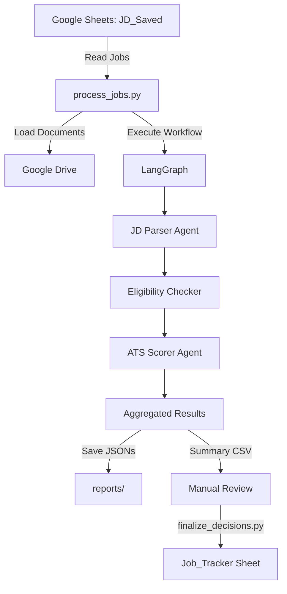

# Job Application Service

An AI-driven, multi-agent platform that transforms how people apply for jobs.

The system makes the entire job-search process — from reading descriptions to applying and tracking results — personalized, explainable, and data-driven. Instead of relying on generic AI résumé tools or opaque ATS algorithms, it parses job postings into structured data, evaluates résumé alignment through transparent scoring, and records applications in a structured dataset for analysis and continuous learning.

---

## Key Features

- **Multi-Agent AI Pipeline**: JD Parser (GPT-4o) + ATS Scorer (GPT-4o) + Rule-based Eligibility Checker
- **30-Point ATS Rubric**: Objective scoring across Technical (13pts), Experience (8pts), Background (9pts) with detailed rationales
- **Smart Eligibility Filtering**: Pre-screening catches deal-breakers (clearance, location, work model) before expensive LLM calls
- **Google Workspace Integration**: Direct connection to Sheets (job tracking) and Drive (resume/documents)
- **Detailed JSON Outputs**: Every job generates 5 JSON files with complete analysis + summary CSV for review
- **Manual Decision Control**: Review AI recommendations, approve/reject jobs, finalize decisions to tracker
- **LangGraph Orchestration**: Conditional workflow routing with error handling and state management
- **Cost Optimization**: Skips scoring for ineligible jobs (~75% cost savings); caches LLM responses; ~$0.04 per eligible job

---

## Quick Start

### Prerequisites

- Python 3.9+ (or Docker)
- **Google Cloud service account with credentials** - See [Google Service Account Setup Guide](docs/GOOGLE_SERVICE_ACCOUNT_SETUP.md) for detailed instructions
- OpenAI API key (GPT-4 family required; GPT-4o recommended)
- Google Sheets for job tracking (JD_Saved and Job_Tracker)

### Installation

**Clone the repository:**

```powershell
git clone https://github.com/OlgaSkv/job-application-service.git
cd job-application-service
```

**Option 1: Docker**

```powershell
# Build image
docker-compose build
```

**Option 2: Native Python**

```powershell
# Create and activate virtual environment
python -m venv venv
.\venv\Scripts\Activate.ps1  # Windows PowerShell
# source venv/bin/activate    # Linux/Mac

# Install dependencies
pip install -r requirements.txt
```

### Configuration

**1. Set up Google Service Account**

Steps:
- Create Google Cloud project
- Enable Google Sheets API and Google Drive API
- Create service account and download `credentials.json`
- Share your Google Sheets and Drive files with the service account email

See [Google Service Account Setup Guide](docs/GOOGLE_SERVICE_ACCOUNT_SETUP.md) for detailed instructions.

**2. Configure the system**

```powershell
# Copy example config
cp config.example.json config.json

# Edit config.json with your:
# - Google Sheet URLs (JD_Saved, Job_Tracker)
# - Google Drive file IDs (resume, personal statement)
# - Output preferences
```

**Note:** The candidate profile JSON is currently stored locally in `data/candidate_profile.json` (not in Google Drive). Use `data/candidate_profile.template.json` as a starting point and see `data/CANDIDATE_PROFILE_GUIDE.md` for details.

**3. Set up environment variables**

```powershell
# Copy example environment file and edit with your API key
cp .env.example .env
# Then edit .env file to add your actual OpenAI API key
```

**4. Test Environment and Connections**

Before initializing Google Sheets, verify that your environment is properly configured:

```powershell
# Test environment setup, API keys, and Google connections
python tests/check_environment.py

# Test specific connections individually (optional)
python tests/test_drive_connection.py     # Test Google Drive access
python tests/test_sheets_connection.py    # Test Google Sheets access
```

This will verify:
- Python environment and dependencies are installed correctly
- `.env` file is properly formatted and contains required API keys
- Google service account credentials are valid
- Google Drive and Sheets APIs are accessible
- Required permissions are configured

If any tests fail, review the error messages and ensure:
- Your `.env` file has the correct OpenAI API key
- `credentials.json` contains valid Google service account credentials
- The service account has been shared with your Google Sheets and Drive files
- Required Google APIs are enabled in your Google Cloud project

**5. Initialize Google Sheets**

```powershell
# Native Python:
python scripts/setup.py --both

# Docker:
docker-compose run --rm app python scripts/setup.py
```

### Usage

**0. Add Jobs to JD_Saved Sheet (Optional: Job Capture Tool)**

Before processing jobs, you need to populate the JD_Saved Google Sheet with job postings. You have two options:

**Option A: Manual Entry (Recommended)**
- Open your JD_Saved Google Sheet
- Add job details manually: job_uid, date_saved, job_url, job_description
- Set `parsed` column to `FALSE`

**Option B: Chrome Extension (Experimental)**

A Chrome browser extension is available to automate job description capture from job boards directly into your JD_Saved sheet.

**Status:** Experimental - not thoroughly tested, use at your own discretion

**Repository:** [https://github.com/OlgaSkv/save-jd-to-sheets](https://github.com/OlgaSkv/save-jd-to-sheets)

**Features:**
- One-click capture from job posting pages
- Multi-source support (LinkedIn, Indeed, Greenhouse, Lever, Workday, etc.)
- Automatic saving with unique ID, timestamp, and URL
- URL deduplication

**Important Notes:**
- Requires separate Google Cloud OAuth setup (different from service account)
- Extension setup instructions in its own README
- Manual entry remains the primary supported workflow

**1. Process Jobs**

```powershell
# Process unprocessed jobs from JD_Saved
python scripts/process_jobs.py --unprocessed

# Process from date range
python scripts/process_jobs.py --date-from 2025-10-01 --date-to 2025-10-25

# Process with a limit
python scripts/process_jobs.py --unprocessed --limit 5

# Process specific jobs by UID
python scripts/process_jobs.py --uids JD-abc123 JD-xyz789

# Docker equivalent (prefix any command):
docker-compose run --rm app python scripts/process_jobs.py --limit 10
```

Outputs:
- `reports/YYYY-MM-DD/summary_TIMESTAMP.csv` - Summary with clickable links and decision column
- Individual JSON files for each job with detailed analysis

**2. Review Results**

Open the generated summary CSV and:
- Review ATS scores and eligibility reports
- Click JSON links to see detailed analysis
- Add "APPLY" or "PASS" in the `decision` column (or leave blank if undecided)

**3. Finalize Decisions**

```powershell
# Dry run (preview changes)
python scripts/finalize_decisions.py --csv reports/2025-10-25/summary_*.csv --dry-run

# Upload approved jobs to tracker
python scripts/finalize_decisions.py --csv reports/2025-10-25/summary_*.csv

# Docker equivalent:
docker-compose run --rm app python scripts/finalize_decisions.py --csv reports/2025-10-25/summary_*.csv
```

**4. View Dashboard (Optional)**

```powershell
# Native Python:
streamlit run streamlit_app.py

# Docker:
docker-compose run --rm -p 8501:8501 app streamlit run streamlit_app.py
# Open: http://localhost:8501
```

---

## Streamlit Dashboard

The system includes an optional web-based dashboard built with Streamlit for viewing processed job results and running jobs interactively.

### Features

- **Job Results Browser**: View processed jobs with filtering and sorting
- **Interactive Processing**: Process individual jobs directly from the web interface
- **Real-time Status**: See processing progress and results immediately
- **JSON Viewer**: Expand and view detailed job analysis data
- **Error Display**: View processing errors and logs in a user-friendly format

### Launching the Dashboard

```powershell
# Start the dashboard
streamlit run streamlit_app.py

# Open in browser (auto-opens by default)
# http://localhost:8501
```

### Dashboard Sections

1. **Processed Jobs Summary**: Table view of all processed jobs with key metrics
2. **Job Processing Interface**: Run jobs individually with real-time feedback
3. **Detailed Views**: Expand rows to see full JSON analysis data
4. **Status Monitoring**: Processing logs and error details

**Note**: The dashboard is a convenience tool for viewing results. The core workflow remains CLI-based for reliability and automation.

---

## Architecture



**Component Interaction (Augmented Intelligence):**

- **JD Parser Agent**: Sees only job description → Extracts structured, analyzable data
- **Eligibility Checker**: Applies your personalized constraints → Identifies fit and concerns
- **ATS Scorer Agent**: Evaluates résumé + job alignment → Generates transparent 30-point assessment
- **Human Decision Layer**: Reviews AI analysis → Makes final strategic decisions with full context

See [Technical Implementation](TECHNICAL_IMPLEMENTATION.md) for detailed architecture.

---

## Documentation

- [Technical Implementation](TECHNICAL_IMPLEMENTATION.md) - Complete technical architecture
- [ATS Scoring Rubric](docs/ATS_SCORING_RUBRIC_30PT.md) - Transparent scoring criteria
- [Job Tracker Columns](docs/JOB_TRACKER_COLUMNS.md) - Schema and field descriptions
- [Google Setup Guide](docs/GOOGLE_SERVICE_ACCOUNT_SETUP.md) - Google Cloud configuration
- [Candidate Profile Guide](data/CANDIDATE_PROFILE_GUIDE.md) - How to configure your candidate profile
- [Next Steps](NEXT_STEPS.md) - Roadmap and future enhancements
- [Chrome Extension for Job Capture](https://github.com/OlgaSkv/save-jd-to-sheets) - Browser extension for automated job saving (experimental)

---

## Project Structure

```
job-tracker/
├── config/                          # Configuration files
│   ├── prompts/                     # LLM prompts (versioned)
│   │   ├── ats_scorer.txt
│   │   └── jd_parser.txt
│   └── schemas/                     # JSON schemas for structured output
│       ├── ats_score_schema.json
│       └── jd_record_schema.json
├── data/                            # Candidate data templates
│   ├── candidate_profile.template.json
│   ├── CANDIDATE_PROFILE_GUIDE.md
│   └── README.md
├── docs/                            # Documentation
│   ├── ATS_SCORING_RUBRIC_30PT.md
│   ├── GOOGLE_SERVICE_ACCOUNT_SETUP.md
│   └── JOB_TRACKER_COLUMNS.md
├── reports/                         # Generated outputs (gitignored)
│   └── README.md
├── scripts/                         # Executable scripts
│   ├── finalize_decisions.py        # Manual approval workflow
│   ├── process_jobs.py              # Main processing pipeline
│   └── setup.py                     # Initialize Google Sheets
├── src/
│   ├── agents/                      # AI agents
│   │   ├── ats_scorer.py            # ATS scoring agent
│   │   └── jd_parser.py             # Job description parser
│   ├── graph/                       # LangGraph workflow
│   │   └── workflow.py
│   ├── models/                      # Pydantic data models
│   │   ├── candidate.py
│   │   ├── job.py
│   │   ├── recommendation.py
│   │   ├── research.py
│   │   └── scoring.py
│   ├── tools/                       # Tools and utilities
│   │   ├── eligibility_checker.py   # Rule-based eligibility logic
│   │   ├── google_drive_tool.py     # Google Drive integration
│   │   └── google_sheets_tool.py    # Google Sheets integration
│   └── utils/                       # Shared utilities
│       ├── config_utils.py
│       ├── distance_calculator.py
│       ├── logging_utils.py
│       └── parser_utils.py
├── tests/                           # Unit and integration tests
│   ├── check_environment.py
│   └── test_distance_calculator.py
├── .dockerignore
├── .gitignore
├── config.example.json              # Example configuration
├── docker-compose.yml               # Docker setup
├── Dockerfile
├── NEXT_STEPS.md
├── README.md
├── requirements.txt
├── streamlit_app.py                 # Optional dashboard
└── TECHNICAL_IMPLEMENTATION.md      # Technical architecture
```

---

## How It Works

The system transforms job search through four key capabilities that work together to provide personalized, data-driven guidance:

### 1. Structured Job Analysis

The **JD Parser** agent converts unstructured job descriptions into analyzable data:
- Company, role, location, compensation details
- Required/preferred technical skills and experience levels
- Work model, seniority expectations, domain knowledge needs
- Education requirements and role-specific competencies
- **Result**: Structured data ready for intelligent evaluation

### 2. Intelligent Eligibility Assessment

The **Eligibility Checker** applies personalized logic to identify fit and concerns:
- **Hard Blockers**: Deal-breakers based on your constraints (clearance, location, etc.)
- **Soft Concerns**: Areas requiring attention but not eliminating opportunities
- **Personalized Filtering**: Adapts to your specific background and preferences
- **Result**: Clear, explainable eligibility decisions

### 3. Transparent Resume-Job Alignment

The **ATS Scorer** agent evaluates fit using a comprehensive 30-point rubric:
- **Technical Alignment (13 pts)**: Skills, technology stack, applied experience
- **Experience Match (8 pts)**: Years of experience, seniority level alignment  
- **Background Fit (9 pts)**: Domain knowledge, education, role type compatibility
- **Result**: Explainable scores with strengths, gaps, and ATS optimization keywords

### 4. Data-Driven Learning and Insights

The system builds a structured dataset of your application journey:
- **Structured Records**: Every job analysis stored as queryable data
- **Trend Analysis**: Identify patterns in scoring, rejection reasons, skill gaps
- **Strategy Refinement**: Learn which types of roles align best with your background
- **Continuous Improvement**: Evolve your approach based on real application data

---

## Vision

The job search process is often characterized by inefficiency, opacity, and guesswork. Traditional approaches rely on manual evaluation, generic tools, or black-box algorithms that provide little insight into decision-making processes. This system transforms that experience by introducing structured intelligence, transparent reasoning, and data-driven insights.

Rather than replacing human judgment, the platform enhances decision-making capabilities through consistent AI analysis while preserving individual agency and strategic control. Every recommendation includes clear rationales, every score provides detailed breakdowns, and every interaction contributes to a growing knowledge base.

The result is a job search experience that becomes progressively more intelligent, efficient, and aligned with individual goals through continuous learning and adaptation.

---

## System Design Principles

- **Augmented Intelligence Over Automation**: AI provides consistent analysis; humans make strategic decisions. *Why: Job search requires nuance, personal goals, and risk tolerance that AI shouldn't own.*

- **Explainability as a First-Class Feature**: Every score includes evidence-based rationale citing resume and JD details. *Why: Trust requires transparency—you need to understand why a job scored 24/30.*

- **Structured Data as Foundation**: All outputs are queryable JSON with consistent schemas. *Why: Enables trend analysis, continuous learning, and data-driven strategy refinement over time.*

- **Determinism Where Compliance Matters**: Rule-based logic for eligibility, security clearance, location constraints. *Why: 100% predictable, auditable results for deal-breakers that must be exact.*

- **Fail-Safe Design**: Errors don't halt execution; they're logged and aggregated in workflow state. *Why: One malformed job description shouldn't block processing 50 others in a batch.*

- **Cost-Conscious Architecture**: Conditional routing skips expensive LLM calls when unnecessary. *Why: ATS scoring costs ~$0.04 per job; skipping ineligible jobs saves 75% on rejected applications.*

---

## Testing

```powershell
# Run all tests
pytest tests/
```

---

## Advanced Usage

### Custom Filtering

```powershell
# Process jobs from a date range
python scripts/process_jobs.py --date-from 2025-10-01

# Combine filters
python scripts/process_jobs.py --unprocessed --date-from 2025-10-15 --limit 20
```

### Dry Run Mode

```powershell
# Preview what would be uploaded without making changes
python scripts/finalize_decisions.py --csv <path> --dry-run
```

### Logging

- Logs are saved to `logs/` directory
- Console output shows progress and errors
- Failed jobs are collected and reported at end

---

## Acknowledgments

- Built with [LangChain](https://www.langchain.com/) and [LangGraph](https://langchain-ai.github.io/langgraph/)
- Powered by OpenAI GPT-4o
- Google Sheets and Drive for data management

---

## Support

For questions or issues:
- Review [TECHNICAL_IMPLEMENTATION.md](TECHNICAL_IMPLEMENTATION.md) for architecture details
- Check logs in `logs/` directory for error details
