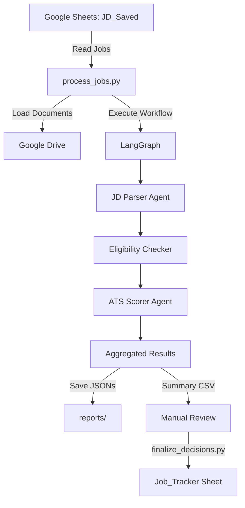

# Job Application Service - Technical Implementation

**Version:** 1.1.0  
**Date:** October 24, 2025  
**Architecture:** LangGraph Multi-Agent System with LangChain

---

## System Overview

The Job Application Service is an AI-driven, multi-agent platform that transforms how people approach job search through personalized, explainable, and data-driven processes. The system combines LLM agents (GPT-4o) with deterministic logic to parse job postings into structured data, evaluate résumé alignment through transparent scoring, and build comprehensive datasets for analysis and strategic learning.

---

## Design Principles

This system was architected around several key principles that guide all implementation decisions:

### 1. **Determinism Where Possible**
Rule-based logic is used for compliance-critical decisions (eligibility, clearance, location) to ensure 100% predictable, auditable results. Deterministic recalculation of scores prevents LLM arithmetic errors.

**Example**: `_calculate_total_score()` uses Python addition instead of trusting LLM math.

### 2. **LLM Validation Through Structure**
Structured output schemas (Pydantic models + JSON schemas) constrain LLM responses to prevent hallucination and ensure data quality.

**Example**: `llm.with_structured_output(JD_PARSER_SCHEMA)` enforces exact field structure.

### 3. **Cost Optimization**
Conditional routing skips expensive LLM calls when unnecessary. Ineligible jobs bypass ATS scoring to reduce API costs.

**Example**: `route_after_eligibility()` returns END if hard blockers exist.

### 4. **Transparency & Explainability**
Every AI decision includes detailed rationales. The 30-point ATS rubric provides clear scoring criteria with evidence-based justification.

**Example**: Each dimension score includes required rationale citing resume evidence.

### 5. **Separation of Concerns**
LLMs handle unstructured text parsing and nuanced evaluation (what they're good at). Rule-based code handles boolean logic and compliance (what code is good at).

**Example**: Eligibility checker is deterministic Python, not an LLM agent.

### 6. **Fail-Safe Error Handling**
Functions return `None` instead of raising exceptions. Errors are logged and collected in workflow state for debugging without halting execution.

**Example**: `parse_job_description()` catches all exceptions and returns None.

---

### Key Components

1. **2 AI Agents** (LangChain + OpenAI GPT-4o)
   - **JD Parser**: Transforms unstructured job descriptions into structured, analyzable data
   - **ATS Scorer**: Provides transparent résumé-to-job alignment evaluation using explainable 30-point rubric

2. **1 Intelligent Rule Engine**
   - **Eligibility Checker**: Applies personalized constraints and preferences for smart filtering

3. **Data-Driven Architecture**
   - **Structured Output Generation**: Creates queryable datasets for trend analysis and learning
   - **Human-Augmented Decision Making**: Combines AI insights with human strategic judgment

4. **LangGraph Workflow**
   - Orchestrates sequential execution with conditional routing
   - Manages state propagation between nodes
   - Handles error recovery and logging

5. **Integration Layer**
   - Google Sheets API: Job data input/output
   - Google Drive API: Resume and document retrieval
   - Local file system: JSON output storage and CSV reports

---

## System Architecture

### High-Level Component Flow



### High-Level Data Flow

```
┌──────────────────┐
│  Google Sheets   │
│   (JD_Saved)     │ ← User manually adds jobs
└────────┬─────────┘
         │ Read jobs (parsed=FALSE)
         ↓
┌──────────────────────────────────────────────────┐
│         process_jobs.py (CLI Script)             │
│  - Loads jobs from Sheets                        │
│  - Loads resume from Google Drive                │
│  - Loads candidate profile from local JSON       │
│  - Runs LangGraph workflow for each job          │
└────────┬─────────────────────────────────────────┘
         │
         ↓
┌────────────────────────────────────────────────┐
│          LangGraph Workflow Engine             │
│                                                 │
│  ┌──────────────┐                              │
│  │  parse_jd    │ ← Agent 1: JD Parser (LLM)   │
│  │   (Node 1)   │   Extracts structured data   │
│  └──────┬───────┘                              │
│         │                                       │
│         ↓                                       │
│  ┌──────────────────────┐                      │
│  │ check_eligibility    │ ← Tool: Rule-based   │
│  │     (Node 2)         │   Hard/soft blockers │
│  └──────┬───────────────┘                      │
│         │                                       │
│         ↓                                       │
│    [Eligible?]                                  │
│         │                                       │
│    ┌────┴────┐                                 │
│    │   Yes   │   No → END                      │
│    ↓         │                                  │
│  ┌──────────────┐                              │
│  │  score_ats   │ ← Agent 2: ATS Scorer (LLM)  │
│  │   (Node 3)   │   30-point rubric            │
│  └──────┬───────┘                              │
│         │                                       │
│         ↓                                       │
│       [END]                                     │
└────────┬───────────────────────────────────────┘
         │
         ↓
┌────────────────────────────────────────┐
│  File System Outputs                   │
│                                         │
│  reports/YYYY-MM-DD/                   │
│  ├── JOB-UID_parsed_jd.json            │
│  ├── JOB-UID_eligibility_report.json   │
│  ├── JOB-UID_ats_score.json            │
│  ├── JOB-UID_flat_report.json          │
│  ├── JOB-UID_full_state.json           │
│  └── summary_YYYYMMDD_HHMMSS.csv       │
└────────────────────────────────────────┘
         │
         ↓
┌────────────────────────────────────────┐
│  Manual Review (User)                  │
│  - Review summary CSV                  │
│  - Add decisions (APPLY/PASS)          │
└────────┬───────────────────────────────┘
         │
         ↓
┌────────────────────────────────────────┐
│  finalize_decisions.py (CLI Script)    │
│  - Reads summary CSV with decisions    │
│  - Updates Job_Tracker sheet           │
│  - Marks jobs as processed             │
└────────────────────────────────────────┘
```

---

## Component Details

### 1. LangGraph Workflow

**File:** `src/graph/workflow.py`

The workflow is implemented using LangGraph's StateGraph pattern, which provides:
- Type-safe state management
- Conditional routing based on business logic
- Error handling and recovery
- Node-level logging and debugging

#### State Schema

```python
class WorkflowState(TypedDict):
    # Input data
    job_uid: str
    job_url: str
    job_portal: Optional[str]
    job_description: str
    date_saved: str
    resume: Optional[str]
    personal_statement: Optional[str]
    candidate_profile: Optional[Dict[str, Any]]
    
    # Intermediate results
    parsed_jd: Optional[Dict[str, Any]]
    eligibility_report: Optional[Dict[str, Any]]
    
    # Final outputs
    ats_score: Optional[Dict[str, Any]]
    
    # Future expansion
    company_report: Optional[Dict[str, Any]]
    coach_recommendation: Optional[Dict[str, Any]]
    
    # Metadata
    skip_scoring: bool
    errors: List[str]
    processing_time: Optional[float]
```

#### Workflow Graph

```
START → parse_jd → check_eligibility → [eligible?] → score_ats → END
                                              │
                                              └─[not eligible]→ END
```

**Node Functions:**
1. **parse_jd_node**: Calls JD Parser agent
2. **check_eligibility_node**: Calls eligibility checker tool
3. **score_ats_node**: Calls ATS Scorer agent
4. **route_after_eligibility**: Conditional routing logic

**Routing Logic:**
```python
def route_after_eligibility(state: WorkflowState) -> str:
    if state.get("skip_scoring", False):
        return END  # Skip scoring if ineligible
    return "score_ats"  # Proceed to scoring
```

---

### 2. Agent 1: JD Parser

**File:** `src/agents/jd_parser.py`  
**Type:** LLM Agent (GPT-4o)  
**Purpose:** Extract structured data from unstructured job postings

#### Input
- Raw job description text (string)

#### Processing
1. Loads prompt template from `config/prompts/jd_parser.txt`
2. Loads JSON schema from `config/schemas/jd_record_schema.json`
3. Uses LangChain's `with_structured_output()` to enforce schema compliance
4. Sends job description + prompt to GPT-4o
5. Validates and returns structured output

#### Output Schema (JDRecord)

```python
{
    "company": str,                    # Normalized company name
    "role": str,                       # Job title
    "role_type": str,                  # Functional category (e.g., "ML Engineering")
    "industry_domain": str,            # Business domain (e.g., "Healthcare")
    "location": str,                   # "City, ST" format
    "compensation": str,               # Salary range
    "job_descr_summary": str,          # 3-5 sentence summary
    "job_descr_full": str,             # Comprehensive rewrite
    "skills_required": List[str],      # Core technologies
    "skills_preferred": List[str],     # Nice-to-have technologies
    "soft_skills": List[str],          # Behavioral competencies
    "seniority": str,                  # Entry/Mid/Senior/Principal
    "employment_type": str,            # FT/PT/Contract/Internship
    "work_model": str,                 # Remote/Hybrid/Onsite
    "clearance_required": str,         # None/Secret/Top Secret
    "years_experience": str,           # e.g., "3-5", "5+", "2"
    "domain_knowledge_required": List[str],
    "domain_knowledge_preferred": List[str],
    "education_required": str,         # High School/Associate/Bachelor's/Master's/PhD
    "education_preferred": str,
    "education_specs": List[str]       # Degree fields (e.g., "computer science")
}
```

#### Configuration

```json
{
  "MODEL_CONFIG": {
    "jd_parser": {
      "model_name": "gpt-4o",
      "temperature": 0
    }
  }
}
```

---

### 3. Eligibility Checker

**File:** `src/tools/eligibility_checker.py`  
**Type:** Rule-Based Tool (Deterministic Python Logic)  
**Purpose:** Identify hard/soft blockers before expensive LLM calls

#### Input
- Parsed JD (JDRecord dictionary)
- Candidate profile (JSON dictionary)

#### Processing Logic

**Hard Blockers** (Deal-breakers):
1. **Company/Title Missing**: Missing critical identifiers
2. **Security Clearance**: Required clearance that candidate won't obtain
3. **Work Model Mismatch**: Onsite job + remote-only candidate
4. **Commute Distance**: Location beyond max_commute_miles (with hybrid exceptions)
5. **Relocation**: Required relocation but candidate unwilling

**Soft Blockers** (Concerns):
1. **Travel Percentage**: Exceeds candidate's max_travel_percent
2. **Certifications**: Required certs that candidate could obtain
3. **Salary**: Below candidate's minimum (if salary disclosed)

#### Output Schema (EligibilityReport)

```python
{
    "job_uid": str,
    "company": str,
    "title": str,
    "eligible": bool,
    "hard_blockers": List[str],
    "soft_blockers": List[str],
    "notes": List[str],
    "commute_distance_miles": Optional[float],
    "timestamp": str
}
```

#### Special Logic: Commute Distance

Uses `distance_calculator.py` utility with Google Maps API:
- Calculates driving distance between candidate location and job location
- Applies exception for hybrid roles with acceptable long-distance commutes
- Example: Philadelphia → NYC (90+ miles) acceptable for hybrid roles

```python
if work_model == "Hybrid" and location in acceptable_long_commute_cities:
    # Allow long commute for hybrid roles
    eligible = True
elif distance > max_commute_miles:
    hard_blockers.append(f"Commute distance {distance} mi exceeds max {max_commute_miles} mi")
```

---

### 4. Agent 2: ATS Scorer

**File:** `src/agents/ats_scorer.py`  
**Type:** LLM Agent (GPT-4o)  
**Purpose:** Evaluate resume-to-JD fit using 30-point scoring rubric  
**Documentation:** See [ATS_SCORING_RUBRIC_30PT.md](docs/ATS_SCORING_RUBRIC_30PT.md) for complete rubric details

#### Input
- Resume text (string)
- Job description text (string)
- Company name (optional, for context)
- Job title (optional, for context)
- Job UID (optional, for tracking)

#### Processing
1. Loads prompt template from `config/prompts/ats_scorer.txt`
2. Loads JSON schema from `config/schemas/ats_score_schema.json`
3. Uses LangChain's `with_structured_output()` to enforce schema compliance
4. Sends resume + job description + scoring rubric to GPT-4o
5. **Deterministically recalculates** total score to prevent LLM arithmetic errors
6. Validates and returns structured 30-point score with rationales

#### Scoring Dimensions (30 Points Total)

**Technical Assessment (13 points):**
1. **Technical Capabilities** (0-6): ML methods, algorithms, theoretical foundation
2. **Technology Stack** (0-4): Languages, frameworks, tools, cloud platforms
3. **Applied Experience** (0-3): Project types, production systems, MLOps

**Experience Assessment (8 points):**
4. **Years of Experience** (0-4): Target field years vs requirement (counts only field-specific years)
5. **Seniority Match** (0-4): Total career level vs job level (uses total career years)

**Background Assessment (9 points):**
6. **Domain/Industry** (0-3): Industry-specific knowledge
7. **Education** (0-3): Degree level and field alignment
8. **Role Type** (0-3): Functional role alignment

#### Output Schema (ATSScore)

```python
{
    "job_uid": str,
    "company": str,
    "title": str,
    
    # Overall scores
    "ats_total_score": int,           # 0-30
    "ats_category": str,              # "ATS Pass" / "ATS Borderline" / "ATS Reject"
    
    # Dimensional scores
    "technical_capabilities_score": int,
    "technical_capabilities_rationale": str,
    "technology_stack_score": int,
    "technology_stack_rationale": str,
    "applied_experience_score": int,
    "applied_experience_rationale": str,
    "years_calculation": str,
    "years_experience_score": int,
    "years_experience_rationale": str,
    "seniority_calculation": str,
    "seniority_match_score": int,
    "seniority_match_rationale": str,
    "domain_score": int,
    "domain_rationale": str,
    "education_score": int,
    "education_rationale": str,
    "role_type_score": int,
    "role_type_rationale": str,
    
    # Summary
    "ats_summary": str,               # 2-3 sentence overall assessment
    "strengths": List[str],           # Key strengths (3-5 items)
    "technical_gaps": List[str],      # Missing skills/experience (3-5 items)
    "skills_for_ats": str,            # Keywords for ATS optimization
    
    "timestamp": str
}
```

#### ATS Categories

- **Pass (24-30)**: 80%+ match → Forward to human review
- **Borderline (17-23)**: 57-80% match → Conditional review
- **Reject (0-16)**: <57% match → Likely filtered out

#### Configuration

```json
{
  "MODEL_CONFIG": {
    "ats_scorer": {
      "model_name": "gpt-4o",
      "temperature": 0
    }
  }
}
```

---

## Data Integration

### Google Sheets Integration

**File:** `src/tools/google_sheets_tool.py`  
**Authentication:** Service account (credentials.json)

#### Input Sheet: JD_Saved

**Columns:**
- `job_uid`: Unique identifier (e.g., "JD-001")
- `date_saved`: Date job was saved (YYYY-MM-DD)
- `job_url`: Job posting URL
- `job_description`: Full job description text
- `parsed`: Boolean flag (FALSE = unprocessed, TRUE = processed)

#### Output Sheet: Job_Tracker

**Columns:** 52 fields including:
- All JDRecord fields (company, role, skills, etc.)
- Eligibility notes (commute distance, location info from eligibility checker)
- All ATSScore fields (scores, rationales, category)
- Metadata: date_saved, date_applied, application_status, notes

**Known Limitation:** Google Sheets does not natively support primary keys or unique constraints. The system currently does not prevent duplicate entries if the same job is approved and finalized multiple times. Manual deduplication is required.

### Google Drive Integration

**File:** `src/tools/google_drive_tool.py`  
**Authentication:** Service account (credentials.json)

**Retrieved Documents:**
- Resume (Google Doc) → Extracted as plain text
- Personal Statement (Google Doc) → Extracted as plain text

**API Operations:**
- `get_file_content(file_id)`: Downloads and extracts text from Google Docs
- `export_as_text()`: Converts Google Doc to plain text format

### Local File System

#### Input: Candidate Profile

**File:** `data/candidate_profile.json`  
**Format:** JSON with candidate preferences and constraints

```json
{
  "name": "Candidate Name",
  "current_location": "Philadelphia, PA",
  "target_locations": ["Remote", "New York, NY"],
  "work_authorization_status": "US Citizen",
  "requires_sponsorship": false,
  "current_clearance": null,
  "willing_to_obtain_clearance": false,
  "willing_to_relocate": false,
  "remote_only": true,
  "hybrid_acceptable": false,
  "onsite_acceptable": false,
  "max_commute_miles": 0,
  "acceptable_long_commute_cities": ["New York, NY"],
  "max_travel_percent": 10,
  "salary_minimum": 140000,
  "salary_currency": "USD",
  "certifications_current": [],
  "certifications_willing": []
}
```

**Setup:**
1. Copy `data/candidate_profile.template.json` to `data/candidate_profile.json`
2. Edit with your personal information
3. File is automatically git-ignored to protect privacy

### Job Capture Automation Tool (Optional)

**Status:** Experimental - Available but not thoroughly tested

A Chrome browser extension is available to automate the capture of job descriptions from job boards directly into the JD_Saved Google Sheet. This tool is provided as-is for users who want to streamline the job collection process.

**Repository:** `https://github.com/YOUR_USERNAME/save-jd-to-sheets` *(update with actual URL after publishing)*

**Features:**
- One-click job description capture from job posting pages
- Multi-source content extraction (LinkedIn, Indeed, Greenhouse, Lever, Workday, etc.)
- Automatic saving to JD_Saved Google Sheet with unique ID, timestamp, URL
- URL canonicalization for deduplication

**Important Notes:**
- **Not thoroughly tested** - Use at your own discretion
- Requires separate Google Cloud OAuth setup (different from service account)
- Manual job entry to JD_Saved sheet is the primary supported workflow
- Extension setup instructions available in its own README

**Recommended Use:** For users comfortable with browser extensions and willing to troubleshoot issues. Manual job entry remains the recommended approach for reliability.

#### Output: JSON Reports

**Directory Structure:**
```
reports/
└── YYYY-MM-DD/
    ├── summary_YYYYMMDD_HHMMSS.csv
    └── jobs/
        └── JOB-UID/
            ├── JOB-UID_parsed_jd.json
            ├── JOB-UID_eligibility_report.json
            ├── JOB-UID_ats_score.json
            ├── JOB-UID_flat_report.json
            └── JOB-UID_full_state.json
```

**File Descriptions:**
- `parsed_jd.json`: JDRecord output from JD Parser
- `eligibility_report.json`: EligibilityReport from Eligibility Checker
- `ats_score.json`: ATSScore output from ATS Scorer
- `flat_report.json`: Flattened key-value pairs for easy reading
- `full_state.json`: Complete workflow state (all fields)

---

## CLI Scripts

### 1. process_jobs.py

**Purpose:** Main processing pipeline

**Usage:**
```bash
# Process all unprocessed jobs
python scripts/process_jobs.py --unprocessed

# Process jobs from specific date range
python scripts/process_jobs.py --date-from 2025-10-15 --date-to 2025-10-18

# Process specific jobs by UID
python scripts/process_jobs.py --uids JD-001 JD-002

# Limit number of jobs processed
python scripts/process_jobs.py --unprocessed --limit 10
```

**Workflow:**
1. Load configuration from `config.json`
2. Connect to Google Sheets and Drive
3. Query jobs based on filters
4. Load resume and candidate profile
5. For each job:
   - Create initial workflow state
   - Run LangGraph workflow
   - Save JSON outputs to `reports/YYYY-MM-DD/jobs/UID/`
   - Collect results for summary
6. Generate summary CSV

### 2. finalize_decisions.py

**Purpose:** Upload approved jobs to tracker and mark as processed

**Usage:**
```bash
# Dry run (preview without changes)
python scripts/finalize_decisions.py --csv reports/2025-10-19/summary_*.csv --dry-run

# Actually process decisions
python scripts/finalize_decisions.py --csv reports/2025-10-19/summary_*.csv
```

**Workflow:**
1. Read summary CSV with user decisions
2. For each job with decision="APPLY":
   - Flatten all job data into Job_Tracker columns
   - Append row to Job_Tracker sheet
3. Mark all processed jobs as `parsed=TRUE` in JD_Saved sheet

### 3. setup.py

**Purpose:** Initialize Google Sheets with correct headers

**Usage:**
```bash
python scripts/setup.py
```

**Actions:**
- Adds column headers to empty JD_Saved sheet
- Adds column headers to empty Job_Tracker sheet
- Safe to run multiple times (won't overwrite data)

---

## Configuration

### config.json

**Required Fields:**
```json
{
  "CREDENTIALS_PATH": "credentials.json",
  "RESUME_FILE_ID": "Google Drive file ID",
  "STATEMENT_FILE_ID": "Google Drive file ID",
  "JD_SAVED_URL": "Google Sheets URL",
  "JOB_TRACKER_URL": "Google Sheets URL",
  "OUTPUT_DIR": "reports",
  "MODEL_CONFIG": {
    "jd_parser": {
      "model_name": "gpt-4o",
      "temperature": 0
    },
    "ats_scorer": {
      "model_name": "gpt-4o",
      "temperature": 0
    }
  }
}
```

### .env

**Required Environment Variables:**
```bash
OPENAI_API_KEY=sk-...
```

### Prompts and Schemas

**Location:** `config/`
```
config/
├── prompts/
│   ├── jd_parser.txt      # JD Parser system prompt
│   └── ats_scorer.txt     # ATS Scorer system prompt with 30-point rubric
└── schemas/
    ├── jd_record_schema.json    # JDRecord JSON schema
    └── ats_score_schema.json    # ATSScore JSON schema
```

---

## Error Handling and Logging

### Logging Strategy

**File:** `src/utils/logging_utils.py`

**Log Levels:**
- `INFO`: Normal workflow progress
- `WARNING`: Non-critical issues (e.g., missing optional fields)
- `ERROR`: Processing failures that don't stop execution

**Log Locations:**
- Console: Real-time feedback
- `logs/job_processing.log`: Persistent file logging

### Error Collection

Errors are collected in the workflow state:
```python
state["errors"]: List[str]  # Accumulated error messages
```

**Error Handling Pattern:**
```python
try:
    result = process_step()
except Exception as e:
    logging.error(f"Error in step: {e}")
    state["errors"].append(f"step: {e}")
    # Continue workflow with degraded state
```

### LLM Caching

**Implementation:** LangChain InMemoryCache
- Caches identical LLM requests within session
- Reduces API costs during development/testing
- Improves response time for repeated jobs

```python
from langchain.globals import set_llm_cache
from langchain_community.cache import InMemoryCache

set_llm_cache(InMemoryCache())
```

---

## Project Structure

```
job-tracker/
├── config/
│   ├── prompts/
│   │   ├── jd_parser.txt
│   │   └── ats_scorer.txt
│   └── schemas/
│       ├── jd_record_schema.json
│       └── ats_score_schema.json
├── data/
│   ├── candidate_profile.json       # Local (git-ignored)
│   ├── candidate_profile.template.json
│   ├── CANDIDATE_PROFILE_GUIDE.md
│   └── README.md
├── docs/
│   ├── ATS_SCORING_RUBRIC_30PT.md
│   ├── GOOGLE_SERVICE_ACCOUNT_SETUP.md
│   └── JOB_TRACKER_COLUMNS.md
├── logs/
│   └── job_processing.log           # Generated at runtime
├── reports/
│   └── YYYY-MM-DD/                  # Generated at runtime
│       ├── summary_*.csv
│       └── jobs/
│           └── JOB-UID/
│               ├── *_parsed_jd.json
│               ├── *_eligibility_report.json
│               ├── *_ats_score.json
│               ├── *_flat_report.json
│               └── *_full_state.json
├── scripts/
│   ├── process_jobs.py
│   ├── finalize_decisions.py
│   └── setup.py
├── src/
│   ├── agents/
│   │   ├── jd_parser.py
│   │   └── ats_scorer.py
│   ├── graph/
│   │   └── workflow.py
│   ├── models/
│   │   ├── candidate.py
│   │   ├── job.py
│   │   ├── scoring.py
│   │   ├── research.py              # Future use
│   │   └── recommendation.py        # Future use
│   ├── tools/
│   │   ├── eligibility_checker.py
│   │   ├── google_drive_tool.py
│   │   └── google_sheets_tool.py
│   └── utils/
│       ├── config_utils.py
│       ├── distance_calculator.py
│       ├── logging_utils.py
│       └── parser_utils.py
├── tests/
│   ├── check_environment.py
│   └── test_distance_calculator.py
├── .env                             # Local (git-ignored)
├── .gitignore
├── config.example.json
├── config.json                      # Local (git-ignored)
├── credentials.json                 # Local (git-ignored)
├── docker-compose.yml
├── Dockerfile
├── NEXT_STEPS.md
├── README.md
├── requirements.txt
├── streamlit_app.py
└── TECHNICAL_IMPLEMENTATION.md      # This file
```

---

## Technology Stack

### Core Dependencies

**LLM Framework:**
- `langgraph==0.2.53`: Workflow orchestration
- `langchain==0.3.12`: LLM abstraction layer
- `langchain-openai==0.2.12`: OpenAI integration
- `langchain-core==0.3.26`: Core abstractions
- `langchain-community==0.3.12`: Community integrations

**LLM Provider:**
- `openai==1.57.2`: OpenAI API client

**Google APIs:**
- `google-api-python-client==2.156.0`: Google Sheets/Drive
- `google-auth==2.37.0`: Service account authentication
- `google-auth-oauthlib==1.2.1`: OAuth flows
- `google-auth-httplib2==0.2.0`: HTTP transport

**Data Processing:**
- `pydantic==2.10.3`: Data validation and schemas
- `python-dotenv==1.0.1`: Environment variable management

**Utilities:**
- `requests==2.32.3`: HTTP requests (distance calculation)

**Development:**
- `pytest==8.3.4`: Testing framework
- `streamlit==1.41.1`: Dashboard UI (optional)

### System Requirements

- **Python:** 3.9+ (3.12+ recommended)
- **Operating System:** Windows/Linux/macOS
- **APIs Required:**
  - OpenAI API (GPT-4o access)
  - Google Sheets API
  - Google Drive API
  - Google Maps API (for distance calculation)

---

## Performance Characteristics

### Processing Times (per job)

**Typical Job Processing:**
- JD Parser (LLM): 3-5 seconds
- Eligibility Checker (rule-based): <0.1 seconds
- ATS Scorer (LLM): 5-8 seconds
- File I/O: <1 second
- **Total:** ~10-15 seconds per job

**Batch Processing:**
- 10 jobs: ~2-3 minutes
- 50 jobs: ~10-15 minutes
- 100 jobs: ~20-30 minutes

### API Costs (approximate)

**Per Job:**
- JD Parser: ~$0.02-0.05 (depends on JD length)
- ATS Scorer: ~$0.03-0.08 (depends on resume length)
- **Total:** ~$0.05-0.13 per job

**Cost Optimization:**
- Ineligible jobs skip ATS Scorer (~40% cost savings on rejected jobs)
- LLM response caching reduces duplicate API calls
- Temperature=0 for consistent, deterministic outputs

---

## Future Enhancements

### Planned Agents (Not Yet Implemented)

1. **Company Researcher Agent**
   - Web search for company information
   - Culture fit analysis
   - Recent news and funding
   - Network analysis (LinkedIn connections)

2. **Career Coach Agent**
   - Synthesize all agent outputs
   - Strategic APPLY/REJECT/MAYBE recommendation
   - Application strategy and positioning guidance
   - Gap mitigation suggestions

### Planned Features

- Parallel job processing (ThreadPoolExecutor)
- Advanced filtering (by company, role, score range)
- Resume version management
- Cover letter generation
- Application tracking and analytics

---

## Known Limitations

### Duplicate Entry Prevention

**Issue:** Google Sheets does not natively support primary keys or unique constraints.

**Impact:** If a user approves the same job multiple times (e.g., re-running `finalize_decisions.py` on the same CSV), the system will append duplicate rows to the Job_Tracker sheet.

**Current Workarounds:**
1. Manual review: Check Job_Tracker for existing entries before finalizing
2. Use `--dry-run` flag to preview what will be uploaded
3. Track processed jobs via the `parsed=TRUE` flag in JD_Saved sheet

**Future Enhancement:** Implement duplicate detection logic:
- Query Job_Tracker for existing job_uid before appending
- Add skip/update logic for duplicate entries
- Provide user prompt for handling duplicates

### Google API Rate Limits

**Issue:** Google Sheets API and Google Drive API have rate limits on requests per minute/per user.

**Impact:** Batch processing of many jobs can trigger rate limit errors (HTTP 429: Too Many Requests), causing API calls to fail.

**Current Mitigation:**
- `sleep()` calls between API requests to throttle request rate
- Implemented in `google_sheets_tool.py` and `google_drive_tool.py`
- Default delay: 1-2 seconds between batch operations

**Rate Limit Thresholds (as of October 2025):**
- Google Sheets API: 60 requests per minute per user
- Google Drive API: 1000 requests per 100 seconds per user

**Best Practices:**
1. Use `--limit` flag to process jobs in smaller batches
2. Allow sufficient time between batch runs
3. Monitor logs for rate limit warnings
4. Consider implementing exponential backoff for retries

**Future Enhancement:** Implement intelligent rate limiting:
- Dynamic throttling based on API response headers
- Exponential backoff with jitter for retry logic
- Request queuing and batching optimization

---

## Maintenance and Operations

### Monitoring

**Key Metrics:**
- Processing success rate
- Average processing time per job
- API error rates
- Cost per job

**Log Analysis:**
- Check `logs/job_processing.log` for errors
- Review `state["errors"]` in full_state.json files

### Troubleshooting

**Common Issues:**

1. **Google API Authentication**
   - Verify `credentials.json` is valid service account key
   - Check that sheets are shared with service account email
   - Ensure APIs are enabled in Google Cloud Console

2. **OpenAI API Errors**
   - Verify `OPENAI_API_KEY` in `.env`
   - Check API quota and billing status
   - Review rate limit errors in logs

3. **Schema Validation Failures**
   - Review LLM output in logs
   - Check if prompt needs refinement
   - Verify schema matches expected output structure

4. **Distance Calculation Failures**
   - Verify Google Maps API key (if used)
   - Check location string formats
   - Review distance_calculator.py error handling

### Backup and Recovery

**Data to Backup:**
- `config.json`: System configuration
- `data/candidate_profile.json`: Candidate preferences
- `credentials.json`: Google service account key
- `.env`: Environment variables

**Google Sheets:**
- Data is already in cloud (Google Sheets)
- Export sheets periodically for offline backup
- Version control: Use Git for code and prompts

---

## Security and Privacy

### Data Privacy

**Sensitive Data Handling:**
- Resume and personal statement: Stored in Google Drive, processed in-memory only
- Candidate profile: Stored locally, excluded from Git (`.gitignore`)
- API keys: Stored in `.env`, excluded from Git

**Data Retention:**
- JSON outputs: Stored locally in `reports/` (git-ignored)
- Google Sheets: Persistent storage under user control
- LLM processing: No data retention by OpenAI (as per API terms)

### Access Control

**Google Service Account:**
- Limited to specific sheets via explicit sharing
- No access to personal Google Drive files (only shared documents)
- Principle of least privilege

**API Keys:**
- OpenAI API key: Environment variable only
- Google credentials: Service account JSON file
- No hardcoded secrets in code

---

## Version History

**v1.0.0** (October 19, 2025)
- Initial production release
- 2-agent system (JD Parser, ATS Scorer)
- Rule-based eligibility checker
- LangGraph workflow orchestration
- Google Sheets/Drive integration
- 30-point ATS scoring rubric
- CLI scripts for processing and finalization

---

**Document Version:** 1.0  
**Last Updated:** October 19, 2025  
**Maintained By:** Development Team
